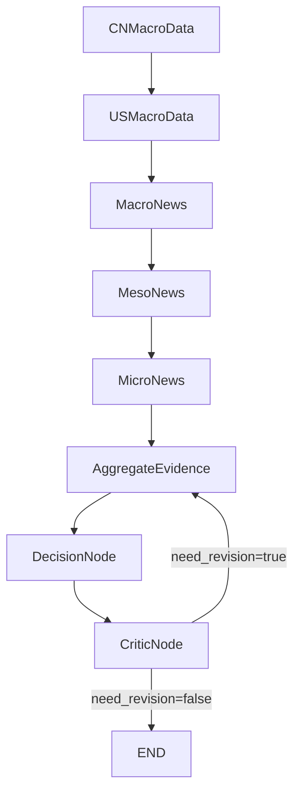

# GoT 宏观投资判断最小可行版说明书

**阅读建议**：工程路径、环境变量、命令行与目录约定以根目录 **[`README.md`](./README.md)** 为准；本文档侧重 **方法论、图结构、节点职责边界与 MVP 验收**，与仓库实现对齐。

**项目核心（与 README 一致）**：以 **某一交易日 D** 为切片，对 **上证综指走势作单日判断**；多宏观与多源资讯经 GoT 归并、决策与批判后，收束为 **对标上证日度锚** 的可执行结论，并与当日快照中的 **上证近端序列**一致。

---

## 1. 文档目标

定义一个「合理且最小可行」的 **Graph of Thoughts (GoT)** 实战框架：用多新闻、多数据与显式张力刻画，**支撑**对 **上证综指在交易日 D 上的单日走势判断**（方向、有效尺度、置信、驱动与可证伪条件），结论可审计、与快照指数对齐。

首版目标是 **跑通该单日判断链路的方法论与工程闭环**，而非追求预测精度上限。

---

## 2. 最小图结构

### 2.1 五路固定输入节点

| 节点 | 职责（语义） |
|------|----------------|
| `CNMacroData` | 中国宏观数据分析 |
| `USMacroData` | 美国宏观数据分析 |
| `MacroNews` | 宏观新闻（政策、全球宏观等） |
| `MesoNews` | 中观新闻（行业、产业链） |
| `MicroNews` | 微观新闻（公司、事件、情绪） |

### 2.2 GoT 核心三节点

| 节点 | 职责（语义） |
|------|----------------|
| `AggregateEvidence` | 归并：共识、冲突、权重、缺失、反证显式化 |
| `DecisionNode` | 决策：在张力下收束为 **D 日上证综指单日走势** 的可执行判断（日度锚） |
| `CriticNode` | 批判：逻辑与风险审计，可选触发一次回流 |

### 2.3 拓扑（与 `graph.py` 一致）

当前 MVP 为 **文件编排**：五输入在 LangGraph 中为 **串行边**（便于顺序加载 JSON），语义上仍为五视角独立解读后再归并。

---

## 3. 执行流程（与仓库行为对应）

### 3.1 统一状态

状态由 LangGraph `StateGraph`（或顺序执行等价路径）承载，主要键包括：

- **`snapshot_inputs`**：当日快照（含独立 **`SSEIndex`** 与五类业务块；加载规则见 **`README` 第 2 节**）。
- **`node_outputs`**：五路输入节点结构化输出。
- **`aggregate`** / **`decision`** / **`critic`**：归并、决策、批判结果。
- **`final_output`**：图结束时的对外结论（读盘模式下通常等于 **`decision`**）。
- **`human_input_for_decision`**：可选；来自同目录 **`HumanInput_{D}.json`** 的非空 **`human_note` / `evidence`**；占位由主控首次创建且**不覆盖已有文件**（详见 **`README` 第 5 节**）。
- **`revision_count`**、**`agent_outputs_dir`**、**`skip_revision_loop`**、**`meta`**：回流计数、读盘路径、是否跳过批判回流、运行元数据。

### 3.2 五路输入节点

编排为串行链；各节点只做本职责内的解释，避免越界重复。  
各节点 JSON 的**机器可读契约**（**`report` / `evidence` / `risk_flags` / `confidence`**）见 **`prompt_md/节点/*.md`**；主控读盘时强制校验。

### 3.3 归并节点 `AggregateEvidence`

输出与输入节点同套四键；在 **`report`** 中组织共识、**结构化冲突**（对立面、张力维度、严重度直觉）、权重、缺失与反证；**`evidence`** 宜从五路压缩摘录最支撑归并结论的短句。详细写作约束见 **`AggregateEvidence.md`**。

### 3.4 决策节点 `DecisionNode`

在 **`AggregateEvidence`** 与（若有）**人类输入**基础上收束为对标上证的短线判断；须写清倾向、时间尺度、置信逻辑、驱动、可证伪与风险。人类文件约定与 **`--decision-only`** 工作流见 **`README` 第 5 节** 与 **[`HumanInput.md`](./src/got_mvp/prompt_md/节点/HumanInput.md)**。

### 3.5 批判节点 `CriticNode`

检查逻辑缺口、过度自信、冲突未解释等；若 **`HumanInput_{D}.json`** 中非空，须核对决策是否显式处理人类约束或与归并冲突时的取舍。  
可选 **`need_revision`**：为真时最多回流 **1** 次至 **`AggregateEvidence`**。**从 Agent 目录读盘时** **`skip_revision_loop`** 为真，不自动多轮回流；需改结论请人工改 JSON 后重跑（见 **`README` 第 11 节**）。

---

## 4. 关键设计原理

### 4.1 为什么要「先分后合」

- **分**：五路逻辑分治，降低单条 prompt 内异构信息稀释注意力。
- **合**：归并显式处理多源矛盾，避免「忽略一半证据」或「机械平均」。

### 4.2 为什么归并是核心

投研中矛盾信号常见（如外紧内松并存）。归并节点的价值在于：**冲突显式化 + 权重可解释 + 结论可审计**。

### 4.3 为什么需要 `CriticNode`

减轻「流畅但脆弱」的归并/决策输出；MVP 以 **一次回流** 平衡效果与成本。

### 4.4 工程硬约束的意义

强约束 **`report` / `evidence` / `risk_flags` / `confidence`**：叙述自由与机器可审计兼顾。**`evidence`** 便于下游将五路事实点与最终叙述对照。

图结束后 **`evaluation.py`** 汇总五路 **`evidence`**，与「归并 + 决策」合并文本做**程序化矛盾粗检**（关键词极性启发式，**非语义模型**），落盘路径与字段说明见 **`README` 第 2、7 节** 及生成的 **`contradiction_evaluation.json`** 内 **`method_note`**。

### 4.5 测试归并时的建议

若快照与节点 JSON 全同向，难以检验归并质量；可在输入或上游 JSON 中 **刻意保留 1～2 处明显矛盾**，观察冲突与权重是否被正确显式化。

---

## 5. 归并节点的提示词策略（方法要求）

归并节点在叙述上建议按以下顺序组织（具体小标题可自拟）：

1. 共识证据（按可信度排序）
2. 冲突证据（注明冲突关系与维度）
3. 权重与理由（时效、来源可信度、可重复性）
4. 综合观点
5. 「若发生 X，则改判为 Y」的反证条件

必须：**不跳过冲突**、**不只给结论不给理由**、输出为单个 JSON 且含 **`report`、`evidence`、`risk_flags`、`confidence`**。

---

## 6. 与 LangGraph 的结合要点

- 用 **`StateGraph`** 承载全局状态，节点间不传递未结构化的自由长文本作为唯一契约。
- 条件边实现 **`CriticNode`** 回流控制；五路串行边仅工程取舍，改为真并行时主要改 **`graph.py`** 边定义并保持状态合并规则。
- 每个节点在 **`meta`** 中记录对应 **`prompt_md/节点/{节点名}.md`** 路径、耗时与粗 token 估计。

---

## 7. MVP 成功标准

- 图可稳定跑完一轮并得到 **`final_output`**，且 **`final_output`** 语义上完成 **D 日上证综指单日走势判断**。
- 冲突在归并中被显式识别并解释。
- 该单日判断的输出含方向、置信度、**关键证据列表**、反证条件（与上证日度锚一致）。
- 允许回流时，批判最多触发 **1** 次至归并（Agent 读盘模式见**第 3.5 节**）。
- 全链路日志可追溯；**矛盾评估 JSON** 可按路径复核。

---

## 8. 后续扩展方向（非本 MVP 范围）

- 滚动窗口（日频/周频再判断）
- 情景层（软着陆/滞胀等）再归并
- 置信度校准与历史样本评估

**待升级专项**（批判靶向回流、MCP 资讯偏差等）：见 **[`待升级环节说明书.md`](./待升级环节说明书.md)**。
